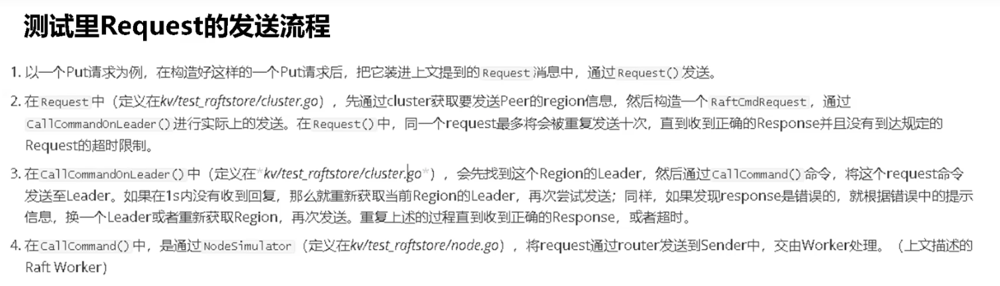
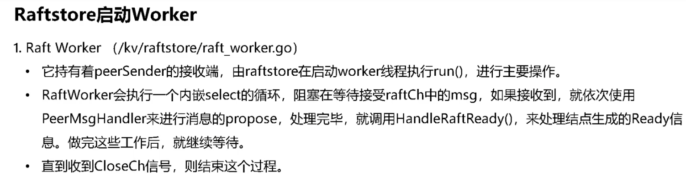

### Lab2B GenericTest测试启动链
| 入参 | 说明                          |
|----|-----------------------------|
| part | 测试标题                        |
| nclients | 客户端数                        |
| unreliable | 网络是否可靠                      |
| crash | 机器会崩溃重启                     |
| partitions | 会发生网络分区                     |
| maxraftlog | 日志最大数量                      |
| confchange | 会发送配置更新的信息                  |
| split | 当节点大小大于1024 bytes时分割为region |
代码流程

1. 新建config，包括心跳，选举时间，region的最大size，GC间隔等
   - 如果split or maxraftlog 为true，则设置对应的config
2. 新建cluster
   - new一个mockschedulerClient（？）
   - new一个nodeSimulator（？）
   - newCluster
3. 启动cluster
   - 新建每个store的kv，raft, snap信息的目录，以及对应engine（用于执行crud）
   - 新建一个region并为其分配peer，使用bootstrap引导相应store
   - bootstrap引导相应engine
   - schedulerClient引导对应store，向其中push store
   - run store

4. 生产n个客户端

5. 判断一些特殊情况

